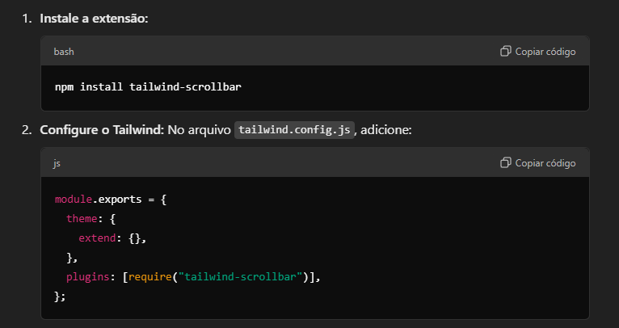

#### rodando o projeto

* Instalar scrollbar

```
<div className="w-1/3 h-64 overflow-y-scroll bg-white border rounded shadow p-4 scrollbar-thin scrollbar-thumb-gray-500 scrollbar-track-gray-100">
```


* Backend - Banco de dandos
```
npx json-server banco.json --port 8080
```

* Frontend - Web
```
npm run dev
```

* gerando build
```
npm run build
```

#### Screens
* page 1.


* page 2.


* criando projeto nextJS

```
npm create-next-app@latest nameProjet
```

* instalando o shadcn-ui
    
```1
npx shadcn@latest init
```

```2
npx shadcn@latest init -d
```

* Configure components.json

#### Ref.
```
https://www.youtube.com/watch?v=PqRe0Q9b5QI
```


export default function ScrollExample() {
  return (
    <div className="h-screen flex justify-center items-center bg-gray-100">
      <div className="w-1/3 h-64 overflow-y-scroll bg-white border rounded shadow p-4 scrollbar-thin scrollbar-thumb-gray-500 scrollbar-track-gray-200">
        <h2 className="text-xl font-bold mb-2">Scroll Vertical Example</h2>
        <p className="mb-4">
          Lorem ipsum dolor sit amet, consectetur adipiscing elit. Integer nec odio. Praesent libero. Sed cursus ante dapibus diam.
        </p>
        <p className="mb-4">
          Curabitur sodales ligula in libero. Sed dignissim lacinia nunc. Curabitur tortor. Pellentesque nibh. Aenean quam.
        </p>
        <p>
          Quisque volutpat condimentum velit. Class aptent taciti sociosqu ad litora torquent per conubia nostra, per inceptos himenaeos.
        </p>
      </div>
    </div>
  );
}
