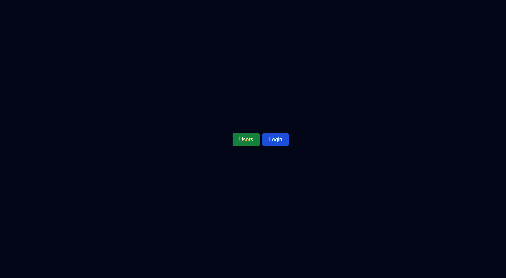

#### rodando o projeto

* Backend - Banco de dandos
npx json-server banco.json --port 8080

* Frontend - Web
npm run dev


#### Screens
* page 1.


* page 2.


* criando projeto nextJS

```
npm create-next-app@latest nameProjet
```

* instalando o shadcn-ui
    
```1
npx shadcn@latest init
```

```2
npx shadcn@latest init -d
```

* Configure components.json

#### Components Shadc-UI
``` 58min
https://ui.shadcn.com/docs/components/accordion
```

#### Ref.
```
https://www.youtube.com/watch?v=PqRe0Q9b5QI
```